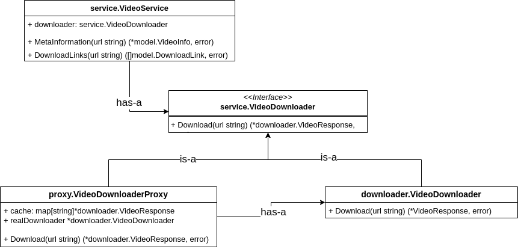

# Video Information and Download Links API
This project is a simple REST API for retrieving video information and download links. It serves as an educational representation of the proxy pattern in Golang.

## Prerequisites
- Go 1.21 or later
## Configuration
Create a .env file in the root directory of the project with the following content:

```dotenv
API_KEY=<your_api_key>
APP_PORT=<port_number>
```
Replace <your_api_key> with your actual API key and <port_number> with the port number you want to run the server on.

## Running the Server
1. Clone the repository:
```bash
git clone https://github.com/yourusername/yourrepository.git
```
2. Navigate to the project directory:
```bash
cd yourrepository
```
3. Install the required dependencies:
```bash
go mod tidy
```
4. Load the environment variables:
```bash
source .env
```
5. Start the server:
```bash
go run cmd/main.go
```
The server will start listening on the port specified in the .env file.

## Infrastructure Diagram
The following diagram depicts the infrastructure of the application:



## Endpoints
- /meta-info?url=<video_url>: Returns the meta information of the video specified by <video_url>.
- /download-links?url=<video_url>: Returns the download links of the video specified by <video_url>.
Replace <video_url> with the actual URL of the video you want to query.